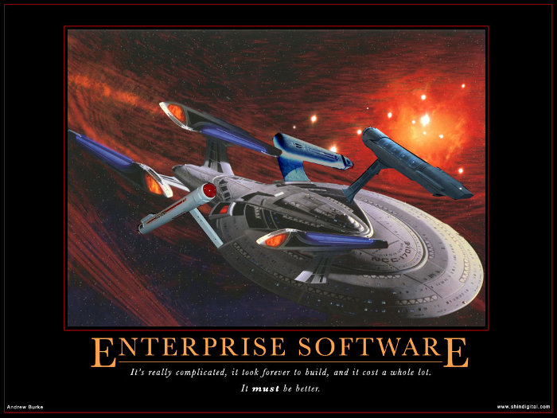
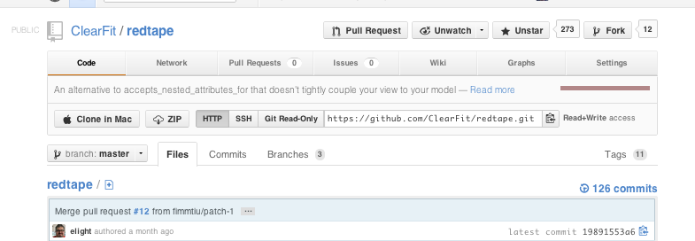
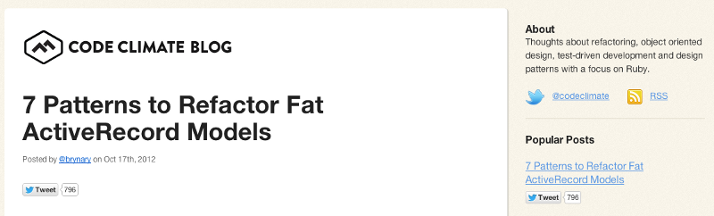

# redtape

!SLIDE

# ClearFit's redtape gem

## github.com/clearfit/redtape

## clearfit.github.com/redtape
!SLIDE

# Introductory...

!SLIDE

Sean Miller, @seanmiller_ca

!SLIDE

Late 1980s...

A high school in Ottawa...

Sean Miller  
Andrew Burke, @ajlburke

!SLIDE

May 7, 2009...

Fixing Careerious: From C#/.NET to Ruby on Rails  

<a href="http://www.shindigital.com/images/Enterprise.jpg"></a>

http://shindigital.com/blogpost/46

!SLIDE

January 2012...


http://dev.clearfit.com/

!SLIDE

Working with...

Evan Light, @elight


http://elight.github.com/fdd/


!SLIDE

and, for a while, with...

Kevin Faustino, @kfaustino

!SLIDE

Kevin Faustino, @kfaustino


http://remarkablelabs.com/

!SLIDE

Clojure...


sean@clearfit.com

!SLIDE

# Back to redtape...

!SLIDE



https://github.com/clearfit/redtape

!SLIDE

October 17, 2012...



http://blog.codeclimate.com/

!SLIDE

# Some sample code

``` ruby
def method
  puts "Hello, World"
end
```

!NOTES

 * a note

!SLIDE

# With a Background Image

}}} images/test.png